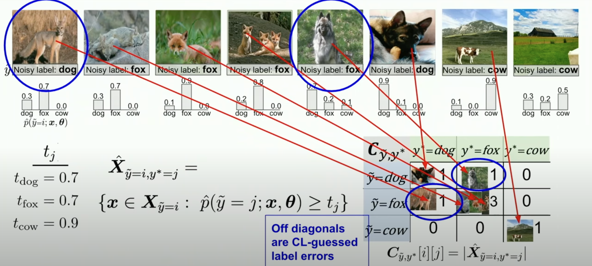

# Confident Learning

As you can see from the above image, confident learning is about estimating the likelyhood of the data being labeled correctly based upon the confidence of the model. If the model confidence is above the threshold confidence (The T_j parameter, t_dog, t_fox t_cow) and if the confidence of the model prediction is higher than the threshold but the label is different, then we predict a wrong label 
## The Principles of Confident Learning
- **Prune** to search for label errors, e.g. following the example of using soft-pruning via loss-reweighting, to avoid the convergence pitfalls of iterative re-labeling.
- **Count** to train on clean data, avoiding error-propagation in learned model weights from reweighting the loss with imperfect predicted probabilities, generalizing seminal work.
- **Rank** which examples to use during training to allow learning with unnormalized probabilities or SVM decision boundary distances, building on well-known robustness findings and ideas of curriculum learning. The idea of ranking involves ordering these examples based on certain criteria. This could be their difficulty, importance, or confidence in their labels.
	 - **Unnormalized probabilities** refer to the raw output of a probabilistic model (like a neural network) before they are converted into normalized probabilities (which sum up to 1). These raw values can give insights into the model's confidence in its predictions.
	- **SVM (Support Vector Machine) decision boundary distances** refer to the distance of data points from the decision boundary in an SVM classifier. Points closer to the boundary are often more ambiguous or difficult for the model, whereas those farther away are more confidently classified.
## Benefits of Confident Learning

Unlike most machine learning approaches, confident learning requires no hyperparameters. We use cross-validation to obtain predicted probabilities out-of-sample. Confident learning features a number of other benefits. CL
- directly estimates the joint distribution of noisy and true labels
- works for multi-class datasets
- finds the label errors (errors are ordered from most likely to least likely)
- is non-iterative (finding training label errors in ImageNet takes 3 minutes)
- is theoretically justified (realistic conditions exactly find label errors and consistent estimation of the joint distribution)
- does not assume randomly uniform label noise (often unrealistic in practice)
- only requires predicted probabilities and noisy labels (any model can be used)
- does not require any true (guaranteed uncorrupted) labels
- extends naturally to multi-label datasets
- is free and open-sourced as the [`cleanlab` Python package](https://github.com/cgnorthcutt/cleanlab) for characterizing, finding, and learning with label errors.

# Links
- [Lecture notes on confident learning](https://dcai.csail.mit.edu/2023/label-errors/)
- [Talk about confident learning, a more brief overview](https://www.youtube.com/watch?v=H_m66Uwh7rg&ab_channel=Cleanlab).

# Thoughts 
- The documentation on cleanlab is awesome and extensive. Makes it easy to use. 
- Cleanlab also has a webpage with a more user-friendly (AKA drop and drag) interface rather than a Python package. 

