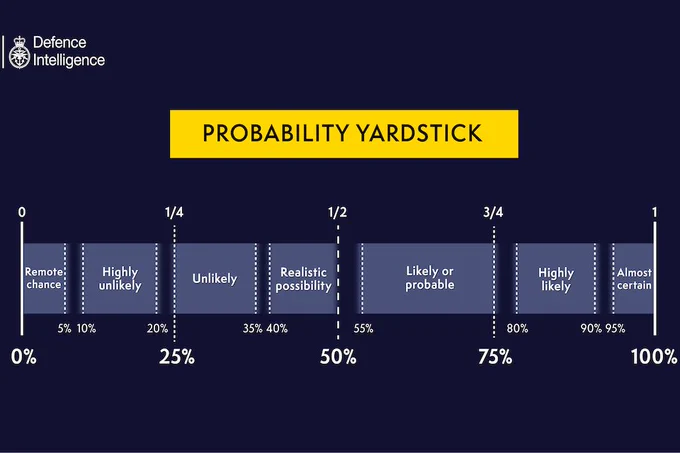

# Statistics

**Correlation:** Any association between two random variables. Correlations are symmetric. 
**Causation:** A change to one variable, the cause, changes the effect. 
**Confounders:** 

### Geometric Brownian Motion 

Brownian motion is random fluctuations. Geometrical Brownian motion is some randomness and drift, usually in a positive direction. It is a random walk but increases over time. 

The Brownian motion is one of the fundamental building blocks of the Black-Scholes formula. 
The ratio of the share prices is the LogNormal distribution if it is modeled as a Geometric Brownian Motion. 
[Video explaining Brownian Motion](https://www.youtube.com/watch?v=sIKD1tQryHg&ab_channel=MathsPartner)
### Probability Yardstick

# Links
- [Confounders](https://www.youtube.com/watch?v=SGGLkrJa9_w&list=WL&index=37&ab_channel=VeryNormal)

# Thoughts 
- 

